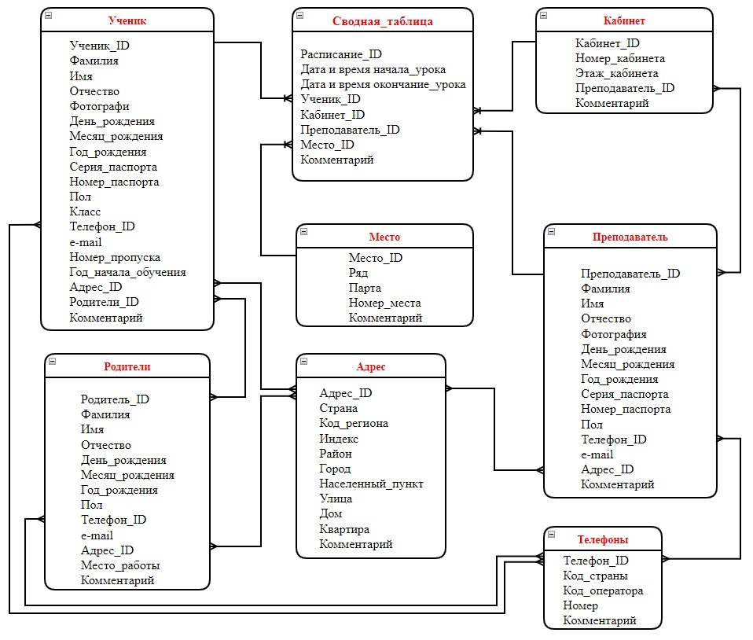

# Знакомство с базами данных (семинары)

## Урок 3. Создание структуры базы данных

---

<u>***Задача***</u>

Опишите базу данных для школьного кабинета, в рамках которой можно фиксировать, кто и в какое время сидел за той или иной партой.

— Место ученика — это ряд, парта, вариант.

— В течение одного дня у разных классов бывает несколько уроков.

— Создайте минимум 3 таблицы: «Кабинет», «Ученик» и сводная таблица, где отображаются парты и ученики.

— Используйте поля «начало урока» и «конец урока» с типом данных TimeStamp.

---

---

## <u>*Связь между таблицами базы данных*</u>

:point_right: [Связь между таблицами](https://github.com/ANT050/Database_homework-3/blob/main/Homework_Database.jpg "Открыть")

---

### Перейти к таблице

- [Сводная таблица](#сводная-таблица "Перейти")
- [Преподаватель](#преподаватель "Перейти")
- [Ученик](#ученик "Перейти")
- [Родители](#родители "Перейти")
- [Адрес](#адрес "Перейти")
- [Телефоны](#телефоны "Перейти")
- [Место](#место "Перейти")
- [Кабинет](#кабинет "Перейти")

---

### Сводная таблица

| Название команды            |Ключ|Тип      |Длина|  Комментарий                                       |
| --------------              |:--:|:-------:|:---:|---------------------------------------------------:|
| Расписание_ID               |да  |integer  |10   |Уникальный идентификатор расписания                 |
| Дата и время начала урока   |    |TimeStamp|14   |Указывается дата и время начала урока               |
| Дата и время окончания урока|    |TimeStamp|14   |Указывается дата и время окончания урока            |
| Ученик_ID                   |    |integer  |7    |Указывается ID Ученика                              |
| Кабинет_ID                  |    |integer  |3    |Указывается ID Кабинета                             |
| Преподаватель_ID            |    |integer  |4    |Указывается ID Преподавателя                        |
| Место_ID                    |    |integer  |2    |Указывается ID Места                                |
| Комментарий                 |    |text     |100  |Указывается комментарий                             |

[Вернуться к списку таблиц ](#refund "Перейти")

---

### Преподаватель

| Название команды    |Ключ|Тип    |Длина|  Комментарий                                       |
| --------------      |:--:|:-----:|:---:|---------------------------------------------------:|
| Преподаватель_ID    |    |integer|4    |Указывается  ID Преподавателя                       |
| Фамилия             |    |text   |30   |Указывается фамилия преподавателя                   |
| Имя                 |    |text   |30   |Указывается имя преподавателя                       |
| Отчество            |    |text   |30   |Указывается отчество преподавателя                  |
| Фотография          |    |blob   |4    |Загружается фотография                              |
| День рождения       |    |interge|2    |Указывается день рождения                           |
| Месяц рождения      |    |interge|2    |Указывается месяц рождения                          |
| Год рождения        |    |integer|4    |Указывается год рождения                            |
| Серия паспорта      |    |integer|4    |Указывается серия паспорта                          |
| Номер паспорта      |    |integer|8    |Указывается номер паспорта                          |
| Пол                 |    |text   |10   |Указывается пол человека                            |
| Телефон_ID          |    |integer|7    |Указывается ID Телефона                             |
| e-mail              |    |text   |50   |Указывается e-mail                                  |
| Адрес_ID            |    |integer|7    |Указывается ID Адреса                               |
| Комментарий         |    |text   |100  |Указывается комментарий                             |

[Вернуться к списку таблиц ](#refund "Перейти")

---

### Ученик

| Название команды    |Ключ|Тип    |Длина|  Комментарий                                       |
| --------------      |:--:|:-----:|:---:|---------------------------------------------------:|
| Ученик_ID           |    |integer|7    |Указывается  ID Ученик                              |
| Фамилия             |    |text   |30   |Указывается фамилия ученика                         |
| Имя                 |    |text   |30   |Указывается имя ученика                             |
| Отчество            |    |text   |30   |Указывается отчество ученика                        |
| Фотография          |    |blob   |4    |Загружается фотография                              |
| День рождения       |    |integer|2    |Указывается день рождения                           |
| Месяц рождения      |    |integer|2    |Указывается месяц рождения                          |
| Год рождения        |    |integer|4    |Указывается год рождения                            |
| Серия паспорта      |    |integer|4    |Указывается серия паспорта                          |
| Номер паспорта      |    |integer|8    |Указывается номер паспорта                          |
| Пол                 |    |text   |10   |Указывается пол человека                            |
| Класс               |    |integer|4    |Указывается номер класса                            |
| Телефон_ID          |    |integer|7    |Указывается ID Телефона                             |
| e-mail              |    |text   |50   |Указывается e-mail                                  |
| Номер_пропуска      |    |text   |30   |Указывается номер пропуска                          |
| Год_начала_обучения |    |integer|4    |Указывается год начала обучения                     |
| Адрес_ID            |    |integer|7    |Указывается ID Адреса                               |
| Родители_ID         |    |integer|7    |Указывается ID Родителя                             |
| Комментарий         |    |text   |100  |Указывается комментарий                             |

[Вернуться к списку таблиц ](#refund "Перейти")

---

### Родители

| Название команды    |Ключ|Тип    |Длина|  Комментарий                                       |
| --------------      |:--:|:-----:|:---:|---------------------------------------------------:|
| Родитель_ID         |    |integer|7    |Указывается ID Родителя                             |
| Фамилия             |    |text   |30   |Указывается фамилия родителя                        |
| Имя                 |    |text   |30   |Указывается имя родителя                            |
| Отчество            |    |text   |30   |Указывается отчество родителя                       |
| День рождения       |    |integer|2    |Указывается день_рождения                           |
| Месяц рождения      |    |integer|2    |Указывается месяц рождения                          |
| Год рождения        |    |integer|4    |Указывается год рождения                            |
| Пол                 |    |text   |10   |Указывается пол человека                            |
| Телефон_ID          |    |integer|7    |Указывается ID Телефона                             |
| e-mail              |    |text   |50   |Указывается e-mail                                  |
| Адрес_ID            |    |integer|7    |Указывается ID Адреса                               |
| Место работы        |    |text   |5    |Указывается место работы родителя                   |
| Комментарий         |    |text   |10   |Указывается комментарий                             |

[Вернуться к списку таблиц ](#refund "Перейти")

---

### Адрес

| Название команды    |Ключ|Тип    |Длина|  Комментарий                                       |
| --------------      |:--:|:-----:|:---:|---------------------------------------------------:|
| Адрес_ID            |да  |integer|7    |Уникальный идентификатор адреса                     |
| Страна              |    |text   |30   |Указывается название страны адреса                  |
| Код региона         |    |integer|3    |Указывается код региона адреса                      |
| Индекс              |    |integer|10   |Указывается почтовый индекс адреса                  |
| Район               |    |text   |50   |Указывается район адреса                            |
| Город               |    |text   |50   |Указывается город адреса                            |
| Населенный пункт    |    |text   |50   |Указывается начеленный пункт адреса                 |
| Улица               |    |text   |50   |Указывается улица адреса                            |
| Дом                 |    |text   |5    |Указывается дом адреса                              |
| Квартира            |    |integer|4    |Указывается квартира адреса                         |
| Комментарий         |    |text   |100  |Указывается комментарий                             |

[Вернуться к списку таблиц ](#refund "Перейти")

---

### Телефоны

| Название команды    |Ключ|Тип    |Длина|  Комментарий                                       |
| --------------      |:--:|:-----:|:---:|---------------------------------------------------:|
| Телефон_ID          |да  |integer|7    |Уникальный идентификатор телефона                   |
| Код страны          |    |text   |4    |Указывается код страны                              |
| Код оператора       |    |integer|4    |Указывается код страны                              |
| Номер               |    |integer|7    |Указывается код страны                              |
| Комментарий         |    |text   |100  |Указывается комментарий                             |

[Вернуться к списку таблиц ](#refund "Перейти")

---

### Место

| Название команды    |Ключ|Тип    |Длина|  Комментарий                                       |
| --------------      |:--:|:-----:|:---:|---------------------------------------------------:|
| Место_ID            |да  |integer|2    |Уникальный идентификатор места                      |
| Ряд                 |    |integer|1    |Указывается ряд места                               |
| Парта               |    |integer|2    |Указывается парта места                             |
| Номер места         |    |integer|1    |Указывается номер места                             |
| Комментарий         |    |text   |100  |Указывается комментарий                             |

[Вернуться к списку таблиц ](#refund "Перейти")

---

### Кабинет

| Название команды    |Ключ|Тип    |Длина|  Комментарий                                           |
| --------------      |:--:|:-----:|:---:|-------------------------------------------------------:|
| Кабинет_ID          |да  |integer|3    |Уникальный идентификатор кабинета                       |
| Номер кабинета      |    |text   |3    |Указывается номер кабинета                              |
| Этаж кабинета       |    |integer|1    |Указывается этаж кабинета                               |
| Преподаватель_ID    |    |integer|5    |Указывается ID ответственного преподавателя за кабинет  |
| Комментарий         |    |text   |100  |Указывается комментарий                                 |

[Вернуться к списку таблиц ](#refund "Перейти")

---

:point_right: [Вначало](#anchor "Вернуться вначало")
